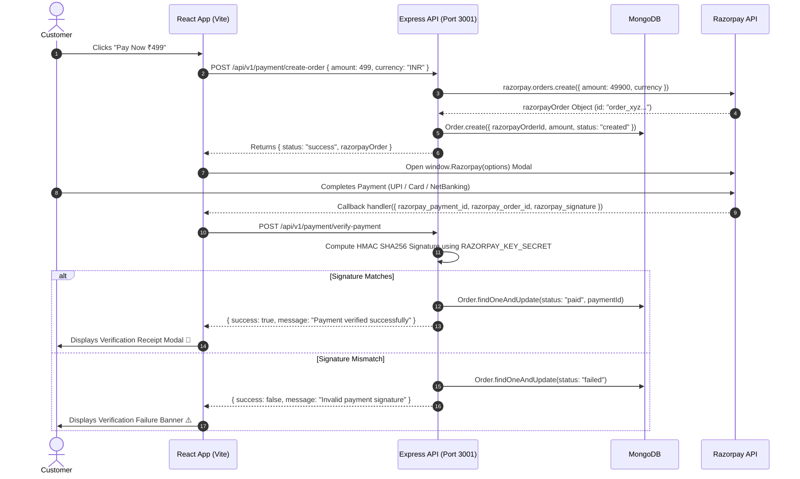

# 💳 Razorpay Payment Gateway Integration (MERN Stack)

A production-ready full-stack payment gateway application built with the **MERN** stack (MongoDB, Express.js, React, Node.js) and integrated with **Razorpay**. It features secure server-side order generation, client-side checkout popup handling, and robust HMAC-SHA256 signature verification.

---

## 🚀 Features

- ⚡ **Seamless Payment Checkout**: Integrated Razorpay Checkout SDK for smooth customer payment flow (UPI, Cards, NetBanking, Wallets).
- 🔒 **Cryptographic Verification**: Server-side HMAC-SHA256 signature validation to prevent payment tampering and fraudulent requests.
- 💾 **Database Persistence**: MongoDB tracking of payment states (`created`, `paid`, `failed`) with sparse indexing on `paymentId`.
- 🎨 **Modern Dark UI**: Responsive React storefront with custom glassmorphic styling, loading states, and animated status overlays.
- 🖨️ **Transaction Receipt Modal**: Instant payment status modal displaying Payment ID, Razorpay Order ID, Timestamp, and a print receipt feature.
- 🌐 **Clean API Architecture**: Modular Express routes and controllers with CORS configured for cross-origin client requests.

---

## 🛠️ Tech Stack

### **Frontend**
- **React 19** + **Vite 8**
- **Axios** (Configured HTTP client)
- **Custom CSS3** (Variables, Glassmorphism, Animations)
- **Razorpay Checkout SDK v1**

### **Backend**
- **Node.js** + **Express 5**
- **MongoDB** + **Mongoose 9**
- **Razorpay Node SDK**
- **Node Crypto** (HMAC-SHA256 Signature Verification)
- **Cors** & **dotenv**

---

## 🔄 Payment Architecture & Sequence Flow



---

## 📁 Project Structure

```text
Razorpay-Payment-Project/
├── client/                     # React + Vite Frontend
│   ├── src/
│   │   ├── api/
│   │   │   └── axios.js        # Centralized Axios instance
│   │   ├── components/
│   │   │   ├── Product.jsx     # Product Storefront & Checkout Launcher
│   │   │   └── PaymentStatus.jsx # Verification Modal & Printable Receipt
│   │   ├── App.jsx             # Main Application Layout
│   │   ├── index.css           # Global Theme & Design System
│   │   └── main.jsx
│   ├── index.html              # Razorpay SDK Script Included
│   ├── vite.config.js
│   └── package.json
│
└── server/                     # Node.js + Express Backend
    ├── config/
    │   └── razorpay.js         # Razorpay SDK Instance Configuration
    ├── controllers/
    │   └── paymentController.js# Order Creation & Verification Logic
    ├── models/
    │   └── Order.js            # Mongoose Order Schema
    ├── routes/
    │   └── paymentRoutes.js    # Express Payment Endpoints
    ├── server.js               # Server Entrypoint & DB Connection
    └── package.json
```

---

## 🔑 Environment Variables Setup

### **1. Server Environment (`server/.env`)**
Create a `.env` file inside the `server/` directory:

```env
PORT=3001
MONGODB_CONN_STR=mongodb://localhost:27017/razorpay-db
RAZORPAY_KEY_ID=rzp_test_your_key_id_here
RAZORPAY_KEY_SECRET=your_key_secret_here
```

### **2. Client Environment (`client/.env`)**
Create a `.env` file inside the `client/` directory:

```env
VITE_RAZORPAY_KEY_ID=rzp_test_your_key_id_here
```

---

## ⚙️ Installation & Local Setup

### **Prerequisites**
- [Node.js](https://nodejs.org/) (v18 or higher)
- [MongoDB](https://www.mongodb.com/) (Local server or MongoDB Atlas URI)
- [Razorpay Account](https://dashboard.razorpay.com/) (Generate Test API Keys)

### **Step 1: Clone the Repository**
```bash
git clone https://github.com/YourUsername/Razorpay-Payment-Project.git
cd Razorpay-Payment-Project
```

### **Step 2: Setup Backend Server**
```bash
cd server
npm install
npm start
```
*Server will start running at `http://localhost:3001`*

### **Step 3: Setup Frontend Client**
In a new terminal window:
```bash
cd client
npm install
npm run dev
```
*Client will start running at `http://localhost:5173`*

---

## 📡 API Endpoints Reference

| Method | Endpoint | Description | Request Body |
| :--- | :--- | :--- | :--- |
| `POST` | `/api/v1/payment/create-order` | Generates Razorpay Order ID & saves order in DB | `{ "amount": 499, "currency": "INR" }` |
| `POST` | `/api/v1/payment/verify-payment` | Verifies cryptographic HMAC-SHA256 signature | `{ "razorpay_order_id", "razorpay_payment_id", "razorpay_signature" }` |

---

## 🛡️ License

This project is open source and available under the [ISC License](LICENSE).
